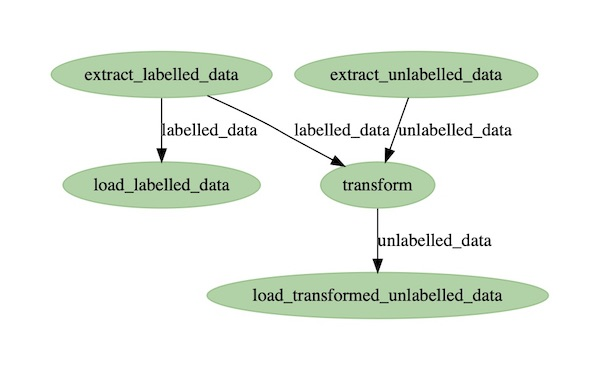

# Reyearn

A data experimentation and model training framework. Reyearn aims to help people evolve machine learning models and inference engines in production by tightly looping the development lifecycle as a dynamic pipeline: ETL -> annotation -> training or tuning -> testing -> deploying. It is designed to be used with existing applications, being installed into the same database. It takes an ensemble-of-models approach.

## TODO

- [x] db for classes, annotations, observations
- [x] split schemas for multi-tenant support
- [x] data ingestion ETL pipeline
- [x] db for experiments and models
- [ ] model training pipeline (implementation stubbed)
- [ ] api endpoints for annotation and prediction
- [ ] default TF-IDF naive bayes text classifier
- [ ] integration tests
- [ ] quickstart docs
- [ ] proper config management
- [ ] basic JWT

## Implementation Notes

Reyearn uses `prefect` to run its workflows ("dags") in a parallel and distributed. The importer dag looks like this:

