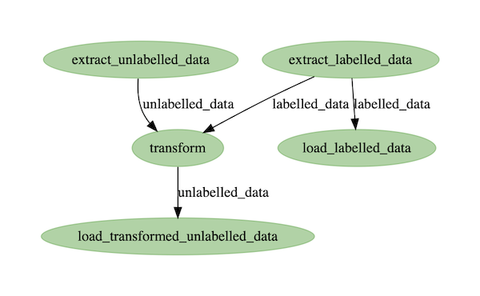
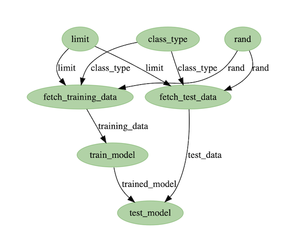

# Reyearn

A data experimentation and model training framework. Reyearn aims to help people evolve machine learning models and inference engines in production by tightly looping the development lifecycle as a dynamic pipeline: ETL -> annotation -> training or tuning -> testing -> deploying. It is designed to be used with existing applications, being installed into the same database. It takes an ensemble-of-models approach.

## TODO

- [x] DB for classes, annotations, observations
- [x] split schemas for multi-tenant support
- [x] data ingestion ETL pipeline
- [x] DB for experiments and models
- [x] model training pipeline (implementation stubbed)
- [x] API endpoints for annotations, predictions and observations
- [ ] default text classifier with gensim
- [ ] UUIDs for external access
- [ ] zip file upload observations
- [ ] integration tests
- [ ] CLI to wrap DAGs and API
- [ ] tutorial in docs
- [ ] proper config management
- [ ] basic JWT

## Implementation Details

Reyearn uses [`prefect`](https://docs.prefect.io/core/getting_started/why-prefect.html) for parallel and distributed execution of workflows (DAGs). It uses [`dask`](https://docs.dask.org/en/latest/why.html) for running serialized distributed tasks that integrate well with the Python data science ecosystem.

The importer DAG looks like this:

The trainer DAG looks like this:

Note: the top-level entities rand, limit, and class_type are parameters for controlling the sample.